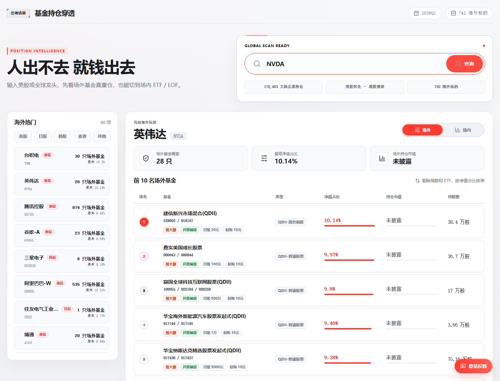

公开域名：https://fund.niliangrui.cloud/
开源仓库：https://github.com/niliangrui1995-web/fund-stock-picker

# 出海钱眼

出海钱眼是一个静态基金持仓穿透工具，用公开基金持仓数据反查海外股票被哪些基金重仓。用户输入美股、港股、日股、韩股或其他海外股票的名称/代码后，页面会展示场外基金和场内 ETF / LOF 等品种的持仓排序；若底层明细披露了海外个股杠杆 ETF / ETP / ETN，也会单独归入“间接 / 杠杆 ETF 暴露”。首页也提供 AI 战报热点入口，便于从 AMD、LITE、COHR、SK海力士等高频标的直接跳到持仓穿透结果。

项目的季度发布入口是 `config/fund-quarter.json`。采集脚本、前端数据加载和发布资产生成都会从这里读取 `year` / `quarter`，当前快照主要用于基金筛选、海外股票持仓穿透和基金集中度研究。页面只做信息展示和研究辅助，不构成投资建议、基金推荐、销售邀约或收益承诺。

## 在线体验

访问：https://fund.niliangrui.cloud/



可以直接搜索这些示例：

- `NVDA` / `英伟达`：查看英伟达被哪些场外基金和场内品种持有。
- `TSM` / `台积电`：查看台积电相关基金持仓排序。
- `00700` / `腾讯控股`：查看腾讯控股在公募基金中的持仓穿透结果。
- `AMD`、`LITE`、`COHR`、`000660`、`005930`：查看 AI 战报热点标的对应的基金持仓穿透结果。

## 功能

- 按股票名称或代码搜索海外标的，例如 `NVDA`、`00700`、`TSM`、`英伟达`、`腾讯控股`。
- 场外口径沿用原有逻辑，剔除基金类型或基金名称中包含“指数”“ETF”“ETF联接”的基金。
- 场内口径覆盖 ETF、LOF、封闭式基金和 REIT，并排除 ETF 联接基金。
- 对海外个股杠杆 ETF / ETP / ETN 做单独的间接暴露识别，展示原始占净值比例和按杠杆倍数折算的估算经济暴露，不并入正股直接持仓口径。
- 首页展示海外热门标的，并支持按美股、港股、日股、韩股和其他市场筛选。
- 首页内置“AI 战报热点”专题区，把最近高频 AI 产业链标的做成快捷卡片，点击后直接进入对应穿透结果。
- 结果展示基金代码、合并份额代码、基金类型、净值占比、持仓市值、持股数、申购状态、赎回状态、起购金额和限购额度。
- 点击或悬停基金行可查看该基金前十大持仓，并高亮当前查询标的。
- 页面内置意见反馈入口；反馈发送依赖部署环境变量，不在代码中保存邮箱密码或收件人地址。

## 数据快照

| 项目 | 当前值 |
| --- | --- |
| 数据周期 | 由 `config/fund-quarter.json` 的 `year` / `quarter` 生成 |
| 截止日期 | 按季度自动派生 |
| 源持仓行数 | `170,017` |
| 源基金数 | `27,023` |
| 源股票总数 | `4,617` |
| 定期报告基金投资明细 | `6` 行 |
| 海外个股杠杆间接暴露 | `4` 行 |
| 前端发布标的 | `741` 个海外标的 |
| 热门候选 | `60` 个 |
| 基金持仓卡片索引 | `1,674` 个基金代码 |
| 前端数据文件 | `public/data/fund-stock-index-<year>q<quarter>.json` |
| AI 战报热点来源 | `config/ai-battle-hotspot-sources.json` |
| AI 战报热点生成配置 | `config/ai-battle-hotspots.json` |
| 海外个股杠杆映射配置 | `config/stock-exposure-aliases.json` |
| 季度发布自检清单 | `public/seo/quarter-release-check.json` |
| 间接暴露维护审计 | `public/seo/indirect-exposure-audit-<year>q<quarter>.md` |

前端只发布海外股票检索范围，完整源股票数量保存在数据文件的 `meta.totalStockCount` 中。`data/eastmoney_cache/` 和 `outputs/` 是本地采集、缓存和中间产物目录，不应提交到公开仓库。

## 技术栈

- React 19
- TypeScript
- Vite 6
- lucide-react
- Python 数据预处理脚本
- 静态 JSON 数据文件
- 可选 Cloudflare Pages Functions / Advanced Mode Worker 处理意见反馈

## 目录结构

```text
.
|-- index.html
|-- config/
|   |-- ai-battle-hotspot-sources.json
|   |-- ai-battle-hotspots.json
|   |-- stock-exposure-aliases.json
|   `-- fund-quarter.json
|-- package.json
|-- public/
|   |-- _headers
|   |-- _worker.js
|   |-- data/
|   |   `-- fund-stock-index-<year>q<quarter>.json
|   `-- seo/
|       |-- indirect-exposure-audit-<year>q<quarter>.md
|       `-- quarter-release-check.json
|-- scripts/
|   |-- analyze_overseas_ai_exposure.py
|   |-- build_ai_battle_hotspots.mjs
|   |-- build_seo_pages.mjs
|   |-- build_fund_stock_index.py
|   |-- fetch_fund_report_holdings.py
|   |-- fetch_fund_holdings.py
|   |-- quarter-config.mjs
|   |-- quarter_config.py
|   `-- verify-live-release.mjs
|-- src/
|   |-- App.tsx
|   |-- fundQuarter.ts
|   |-- main.tsx
|   `-- styles.css
|-- tsconfig.json
`-- vite.config.ts
```

## 本地运行

安装依赖：

```powershell
npm install
```

启动开发服务：

```powershell
npm run dev
```

生产构建：

```powershell
npm run build
```

本地预览生产构建：

```powershell
npm run preview
```

发布到 Cloudflare Pages 后，最短检查路径是直接核对线上产物和旧股票深链：

```powershell
npm run verify-live-release
```

该命令会直接请求 `https://fund.niliangrui.cloud/seo/quarter-release-check.json`、清单里记录的前端数据文件，以及旧 `/stocks/<code>/` 深链样例（`AMD`、`LITE`、`COHR`、`000660`、`005930`、`MU`、`SNDK`），并与本地 `config/fund-quarter.json`、`public/seo/quarter-release-check.json` 核对。全部通过时说明线上站点已经换成当前季度产物，且旧股票链接会落到带 `?stock=` 的首页；失败时会列出不一致字段并以非零退出码结束。

## 数据生成

当前前端读取路径由季度配置派生：

```text
public/data/fund-stock-index-<year>q<quarter>.json
```

数据文件由脚本生成，不建议手工编辑。典型流程如下：

```powershell
python scripts\fetch_fund_holdings.py
python scripts\fetch_fund_report_holdings.py
python scripts\analyze_overseas_ai_exposure.py
python scripts\build_fund_stock_index.py
npm run build
```

其中 `scripts\analyze_overseas_ai_exposure.py` 会同步刷新 `outputs/fund_purchase_limit_snapshot.csv`，`scripts\build_fund_stock_index.py` 会把该快照写入前端基金卡片，并在数据文件 `meta` 中记录 `purchaseLimitFetchedAt`、`purchaseLimitNetValueDates` 和 `purchaseLimitSource`，便于核对限额新鲜度。

生成脚本会读取 `config/fund-quarter.json`，并按 `<year>q<quarter>` 自动命名缓存、输出和前端 JSON：

```text
data/eastmoney_cache/       # 本地缓存，不提交
outputs/                    # 本地中间产物，不提交
public/data/*.json          # 前端发布数据
```

`npm run build` 会先执行 `npm run seo`。SEO 生成步骤会先运行 `npm run hotspots`，把 `config/ai-battle-hotspot-sources.json` 刷新成首页使用的 `config/ai-battle-hotspots.json`；随后读取当前季度的前端 JSON，清理旧股票静态页，生成 `sitemap.xml`、`og-image.svg`，并同步写出 `public/seo/quarter-release-check.json`。如果配置的 `report` 或季度截止日和数据文件 `meta` 不一致，构建会直接失败。

## 海外个股杠杆间接暴露

间接暴露入口用于处理基金持有海外单股杠杆产品的情况，例如 2X / 3X 做多某只海外股票的 ETF、ETP 或 ETN。它不会把这类产品混入正股直接持仓表，而是在对应正股结果页下方单独展示。

这类产品不一定出现在东财 / 天天基金的 `FundArchivesDatas.aspx?type=jjcc` 股票持仓明细里，因此补充了定期报告 PDF 解析流程：

- `scripts\fetch_fund_report_holdings.py` 先从现有股票持仓 CSV 中定位已经持有海外公司的基金。
- 默认继续筛选其中的 LOF 基金，避免无差别下载所有基金报告。
- 脚本下载对应季度的定期报告，解析“基金投资明细”表，输出 `outputs/holdings_fund_investment_<year>q<quarter>.csv`。
- `scripts/build_fund_stock_index.py` 会把股票持仓明细和定期报告基金投资明细一起用于间接暴露识别，但正股直接持仓口径仍只来自股票持仓明细。

识别规则由 `scripts/build_fund_stock_index.py`、`scripts\fetch_fund_report_holdings.py` 和 `config/stock-exposure-aliases.json` 共同完成：

- 自动扫描持仓证券代码和名称中包含 `2X`、`3X`、`杠杆`、`Leveraged`、`Ultra`、`Long`、`Bull` 等特征的海外单股产品。
- 使用股票代码、股票名称和 `stockAliases` 把产品映射回对应正股，例如 `NVDL` 映射到 `NVDA`。
- `knownProducts` 用于补充容易漏识别的已知产品代码。
- `ignoredProducts` 用于记录已确认不是单股杠杆产品的行业 / 主题 / 指数杠杆 ETF，审计页会显示暂不映射原因。
- 排除 `Short`、`Bear`、`Inverse`、`做空`、`反向` 等反向产品。
- 估算经济暴露 = 基金披露的原占净值比例 × 产品杠杆倍数，仅作方向性穿透。

当前 2026Q1 流程从 `79` 只“持有海外公司且属于 LOF”的候选基金里，解析出 `6` 行杠杆基金投资明细，并映射出 `4` 行海外个股杠杆间接暴露。其中 `016823` / `164212` 天弘全球新能源汽车股票(QDII-LOF) 通过 `7709.HK` 持有 `CSOP SK Hynix Daily 2x Leveraged Product`，通过 `7747.HK` 持有 `CSOP Samsung Electronics Daily 2x Leveraged Product`；页面会分别归入 `000660` / SK海力士和 `005930` / 三星电子的“间接 / 杠杆 ETF 暴露”表。

`019710` / `019711` 广发道琼斯石油指数(QDII-LOF) 解析出的 `ProShares Ultra Energy` 对应 `DIG`。它是 2x 能源行业指数 ETF，跟踪 S&P Energy Select Sector Index，不是单一正股杠杆产品，因此已记录在 `ignoredProducts`，不要映射到 XOM / CVX 等站内正股。

维护者审计文件由 `scripts\build_fund_stock_index.py` 同步生成到 `public/seo/indirect-exposure-audit-<year>q<quarter>.md`。它串起本季定期报告解析候选、候选跳过原因、杠杆产品到正股的映射关系，以及最终进入前端数据的 `meta.indirectExposureRows` 数量；排查间接暴露时先看这个文件，不需要先读脚本。

## AI 战报热点入口

AI 战报热点入口不是通用新闻聚合。它只维护一组近期高频标的，并把它们映射到站内已有的基金持仓穿透结果。

日常只维护热点来源文件 `config/ai-battle-hotspot-sources.json`：

```json
[
  {
    "code": "AMD",
    "source": "邮件战报",
    "signal": "AMD 抢锁 CW 激光器",
    "track": "核心算力 / 光互连拉货",
    "thesis": "MI450 与 CW 激光器产能争夺是近期战报高频线索，先看哪些 QDII 主动基金已经有持仓暴露。"
  }
]
```

刷新热点入口：

```powershell
npm run hotspots
```

该命令会读取当前季度的 `public/data/fund-stock-index-<year>q<quarter>.json`，确认热点 `code` 已存在，再优先用 `outputs/overseas_ai_position_details_<year>q<quarter>.csv` 补充海外 AI 口径 / 分类，最后生成 `config/ai-battle-hotspots.json`。如果海外 AI 明细文件不存在，脚本仍会用前端持仓索引生成热点，但不会伪造 AI 分类证据。

页面行为：

- 首页只渲染当前前端 JSON 中真实存在的热点标的。
- 点击热点卡片会复用现有选股逻辑，直接切换右侧基金持仓穿透结果。
- `npm run seo` 会先刷新热点配置，再生成当前季度发布清单和站点基础 SEO 资产。

维护规则：

- 新增热点时，只改 `config/ai-battle-hotspot-sources.json`，不要直接手改 `config/ai-battle-hotspots.json`。
- `code` 使用站内股票代码口径，例如 `AMD`、`LITE`、`COHR`、`000660`、`005930`；脚本会确认当前季度前端 JSON 里存在同一 `code`。
- `source` / `signal` 记录热点线索来源和一句话摘要，不复制邮件全文或临时新闻流。
- `track` 写给首页卡片看的产业链标签；留空时脚本会尝试用海外 AI 明细里的“口径 / 分类”补齐。
- `thesis` 写站内入口理由，不写长新闻正文。
- `label` 和 `evidence` 由脚本根据当前季度前端 JSON、海外 AI 明细和持仓指标生成。

## 切换季度发布

下一次切到 Q2，只改一个入口：

```json
{
  "year": 2026,
  "quarter": 2
}
```

保存 `config/fund-quarter.json` 后重新运行“数据生成”流程。脚本会自动使用 `2026Q2`、`2026q2`、`2026-06-30` 和对应的输入输出文件名。跨年时再同时改 `year`。

## 季度发布自检

发布后使用 `npm run verify-live-release` 快速确认当前站点挂载的是同一套季度产物。它会核对：

- `config/fund-quarter.json` 派生出的 `report` 和 `cutoffDate`。
- 浏览器实际请求的前端数据文件名，例如 `fund-stock-index-2026q1.json`。
- 前端数据文件 `meta.report`、`meta.cutoffDate`、`meta.generatedAt`。
- `public/seo/quarter-release-check.json` 记录的发布清单、sitemap `lastmod` 和 OG/sitemap 使用的季度。
- 旧 `/stocks/<code>/` 深链样例会真实请求 `https://fund.niliangrui.cloud/stocks/AMD/`、`LITE`、`COHR`、`000660`、`005930`、`MU`、`SNDK`，确认最终回到 `/?stock=<code>` 并能保留正确股票上下文。

正常情况下，命令会显示所有检查通过。若数据 JSON、自检清单或发布清单缺失 / 不一致，命令会列出不一致字段并以非零退出码结束。

## 意见反馈配置

`public/_worker.js` 提供可选的反馈接口：

```text
POST /api/feedback
```

接口通过部署平台的环境变量读取发件邮箱、授权密钥和收件邮箱，代码仓库中不保存真实邮箱密码或收件人地址。

需要在部署平台配置：

```text
FEEDBACK_EMAIL_ADDRESS
FEEDBACK_EMAIL_PASSWORD
FEEDBACK_RECEIVER_EMAIL
```

反馈接口已包含基础保护：

- 只接受同源请求。
- 只接受 JSON 请求。
- 限制联系方式和留言长度。
- 限制请求体大小。
- 内置隐藏字段拦截简单机器人提交。
- 使用 Worker 内存做轻量频率限制。
- 邮件正文做 HTML 转义和 SMTP 点转义。

如果公开流量增大，建议继续在平台侧启用 Cloudflare Turnstile、WAF 或 Rate Limiting。Worker 内存限流只能作为基础保护，不能替代平台级反滥用策略。

## 部署

这是一个静态站点，`npm run build` 后会生成 `dist/`。可以部署到 Cloudflare Pages、GitHub Pages、Netlify、Vercel 或任意静态托管平台。

如果使用反馈接口，需要选择支持 `public/_worker.js` 的部署方式，并在部署平台配置上面的环境变量。如果不需要反馈接口，可以移除反馈按钮和 `_worker.js`，仅按普通静态站点发布。

`public/_headers` 包含基础安全响应头：

- Content Security Policy 只允许同源脚本、样式、字体和数据请求。
- `X-Content-Type-Options: nosniff`
- `X-Frame-Options: DENY`
- `Referrer-Policy: strict-origin-when-cross-origin`
- 禁用摄像头、麦克风、定位、支付、USB 等浏览器权限。

## 开源前安全检查

发布到公开 GitHub 前建议至少执行：

```powershell
npm run build
npm audit --audit-level=moderate
rg -n -I "password|passwd|secret|token|api[_-]?key|auth[_-]?key|private[_-]?key|@[A-Za-z0-9.-]+\.[A-Za-z]{2,}" -g "!node_modules/**" -g "!dist/**" -g "!data/eastmoney_cache/**" -g "!outputs/**" .
```

同时确认：

- 不提交 `.env`、`.env.*`、`.dev.vars`、`.wrangler/`。
- 不提交 `data/eastmoney_cache/` 和 `outputs/`。
- 不把个人域名、个人邮箱、API 密钥、SMTP 授权码、Cloudflare Token 写入 README、源码、提交信息或 Issues。
- 如果旧 Git 历史曾经包含个人部署信息，公开发布时建议新建干净仓库或重写历史后再推送。
- 已添加 MIT 开源许可证文件，详见 `LICENSE`。

## 常见问题

### 页面显示“数据载入失败”

确认前端数据文件存在：

```powershell
$config = Get-Content config\fund-quarter.json | ConvertFrom-Json
$label = "$($config.year)q$($config.quarter)"
Test-Path "public\data\fund-stock-index-$label.json"
```

如果不存在，重新生成数据并构建：

```powershell
python scripts\build_fund_stock_index.py
npm run build
```

### 搜索某只股票没有结果

当前前端只发布海外股票检索范围。如果目标是 A 股，可能存在于源数据中，但不会出现在前端搜索文件里。

### 场内基金显示为空

优先检查数据文件中该股票是否存在 `topOnExchangeByRatio`、`onExchangeFundCount` 和 `onExchangeMaxRatioPercent`。场内口径只包含 ETF、LOF、封闭式基金和 REIT，并排除 ETF 联接基金。

### 为什么看不到某只单股杠杆 ETF 的间接暴露

先检查数据文件的 `meta.indirectExposureRows` 和 `meta.fundInvestmentSourceRows`。如果 `fundInvestmentSourceRows` 为 `0`，说明还没有运行定期报告 PDF 补充流程；如果 `fundInvestmentSourceRows` 有值但某只产品没出现，通常是报告里没有披露、产品名称无法映射到正股，或该基金不在当前候选范围内。

也可以先打开 `public/seo/indirect-exposure-audit-<year>q<quarter>.md`。审计文件会列出本季哪些 LOF/QDII 定期报告被解析、哪些候选未进入 `indirectExposureRows`、哪些解析到的杠杆产品没有映射到站内正股，以及最终映射进前端数据的行数。

如果审计里出现 `ProShares Ultra Energy` / `DIG`，它属于已确认暂不映射的行业 ETF，不是某只能源正股的单股杠杆产品；优先看审计页“解析到但未映射的杠杆明细”的处理结果，不要为它补单股别名。

当前默认流程会先定位持有海外公司的基金，再筛选 LOF 基金下载定期报告。若需要扩大范围，可以用 `scripts\fetch_fund_report_holdings.py` 的候选范围参数生成更大的补充明细，再重新运行 `scripts\build_fund_stock_index.py` 和 `npm run build`。

### 生产预览看到旧数据

重新生成数据、重新构建并刷新预览：

```powershell
python scripts\build_fund_stock_index.py
npm run build
npm run preview
```

### 季度发布自检失败

优先确认当前季度数据和发布自检清单是否都重新生成：

```powershell
$config = Get-Content config\fund-quarter.json | ConvertFrom-Json
$label = "$($config.year)q$($config.quarter)"
Test-Path "public\data\fund-stock-index-$label.json"
Test-Path "public\seo\quarter-release-check.json"
npm run build
```

如果构建失败，先看错误里的 `Configured quarter` 或 `Configured cutoffDate` 提示，通常是 `config/fund-quarter.json` 已切季，但 `public/data/fund-stock-index-<year>q<quarter>.json` 还没有按新季度重建。

## 维护约定

- 不手工修改 `public/data/fund-stock-index-<year>q<quarter>.json`，只通过脚本重建。
- 不手工维护 `config/ai-battle-hotspots.json` 和 `public/seo/quarter-release-check.json`；`npm run seo` 会先刷新 AI 战报热点，再生成当前季度发布清单和站点基础 SEO 资产。
- 不手工维护 `public/seo/indirect-exposure-audit-<year>q<quarter>.md`；重新运行 `scripts\build_fund_stock_index.py` 会按当前解析结果和映射配置生成。
- 不提交 `node_modules/`、`dist/`、缓存目录、输出目录、环境变量文件和本地平台配置。
- 修改数据口径后，同步更新 README 的数据说明和常见问题。
- 发布前跑构建、依赖审计和隐私关键词扫描。
- 所有中文文件保持 UTF-8 编码。

## 许可证

本项目采用 MIT License，详见 `LICENSE`。

## 免责声明

本项目基于公开基金定期报告、基金持仓明细和申购状态快照整理，仅供信息展示和研究参考，不构成任何投资建议、基金推荐、销售邀约或收益承诺。基金持仓、申购赎回、费率和限额可能存在披露滞后或实时变化，请以基金管理人、基金销售机构及监管披露文件为准。基金有风险，投资需谨慎。
